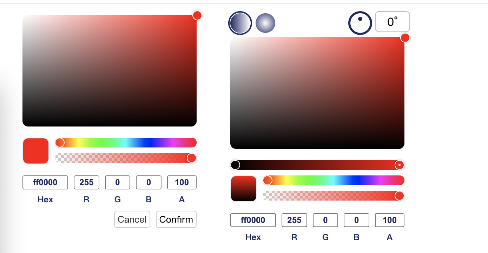

<!--
 * @Descripttion:
 * @version:
 * @Author: June
 * @Date: 2023-03-17 22:02:02
 * @LastEditors: June
 * @LastEditTime: 2024-12-10 13:57:48
-->

## color-gradient-picker-vue3

Color and gradient picker for vue3.js.

[](https://www.npmjs.com/package/color-gradient-picker-vue3)
[](https://www.npmjs.com/package/color-gradient-picker-vue3)




## color-gradient-picker-vue3

Color and gradient picker for vue3.js. It supports `RBG`, `HSL`, `HSV`, `CMYK`.

#### Usage

```bash
yarn add color-gradient-picker-vue3
# or npm install color-gradient-picker-vue3 or pnpm install color-gradient-picker-vue3
```

```html
<!-- beta -->
<template>
  <div id="app" class="flex justify-start items-center">
    <ColorPicker v-model:value="curColor" @change="onChange" />

    <div
      class="w-50px h-50px rounded-10px"
      :style="{ background: curColor }"
    ></div>
  </div>
</template>

<script lang="ts" setup>
  import { ColorPicker } from '@/components/ColorPicker'

  const curColor = ref('rgba(175, 51, 242, 1)')
  const onChange = (val: any) => {
    console.log(val, 'colorpicker 回调')
  }
  // 文档未完善
  // 返回值说明
  // {
  //     "color": "linear-gradient(90deg, rgba(245,66,245,1) 0%, RGBA(245,66,245,1) 40%, rgba(0,0,255,1) 100%)",  颜色字符串
  //     "mode": "gradient", 模式  gradient | solid
  //     "degrees": 90,  渐变角度  gradient时返回
  //     "gradientType": "linear", 渐变类型 gradient时返回
  //     "gradientColors": [ // 渐变颜色数组
  //         {
  //             "color": "rgba(245,66,245,1)",
  //             "left": 0
  //         },
  //         {
  //             "color": "rgba(245,66,245,1)",
  //             "left": 40
  //         },
  //         {
  //             "color": "rgba(0,0,255,1)",
  //             "left": 100
  //         }
  //     ]
  // }
</script>
```

#### 启动 lib

```bash
# 安装依赖
pnpm install

# 启动lib(根目录或者lib下)
pnpm dev
```
