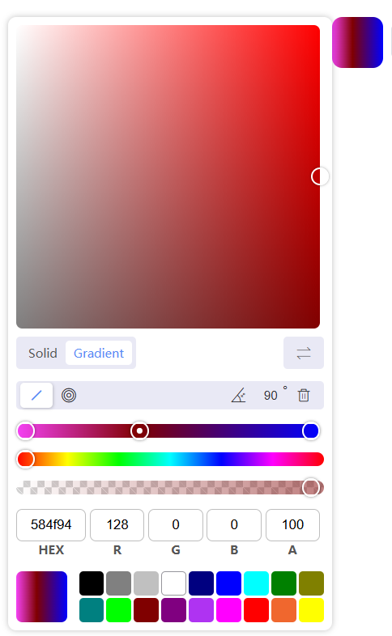

<!--
 * @Descripttion:
 * @version:
 * @Author: June
 * @Date: 2023-03-17 22:02:02
 * @LastEditors: June
 * @LastEditTime: 2023-10-04 12:35:11
-->

## color-gradient-picker-vue3

Color and gradient picker for vue3.js. [If you use vue2， plese use color-gradient-picker](https://github.com/arthay/vue-color-gradient-picker).color-gradient-picker-vue3 is an upgraded version of `color-gradient-picker`




[查看文档](./lib/README.md)

#### Usage

```bash
yarn add color-gradient-picker-vue3
# or npm install color-gradient-picker-vue3 or pnpm install color-gradient-picker-vue3
```

#### 启动 lib

```bash
# 安装依赖
pnpm install

# 启动lib(根目录或者lib下)
pnpm dev

# 预览packages的子项目
# 根目录
pnpm predev
# 子项目下
pnpm dev
```
